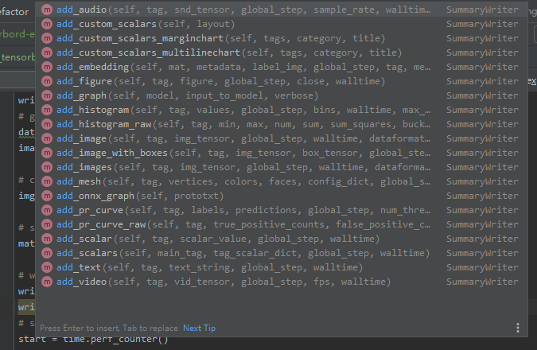
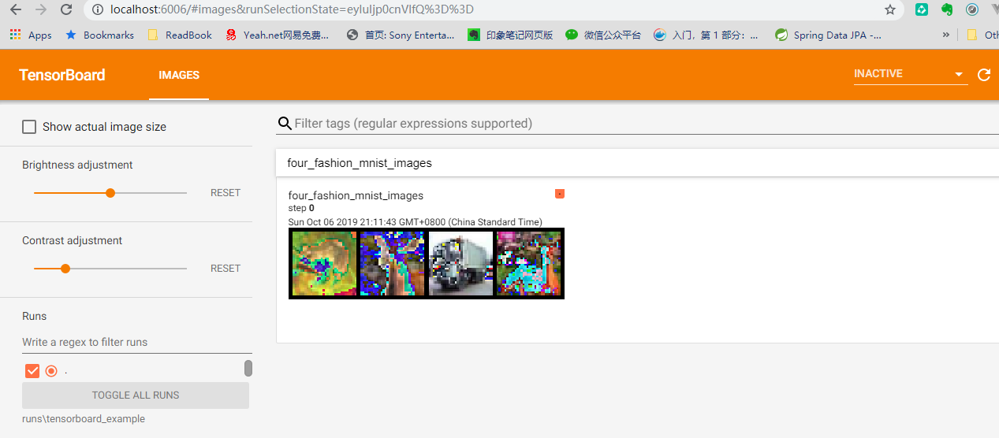
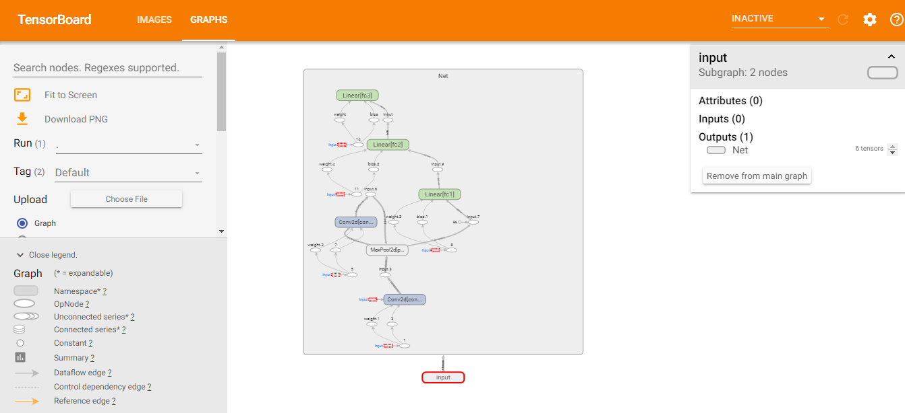
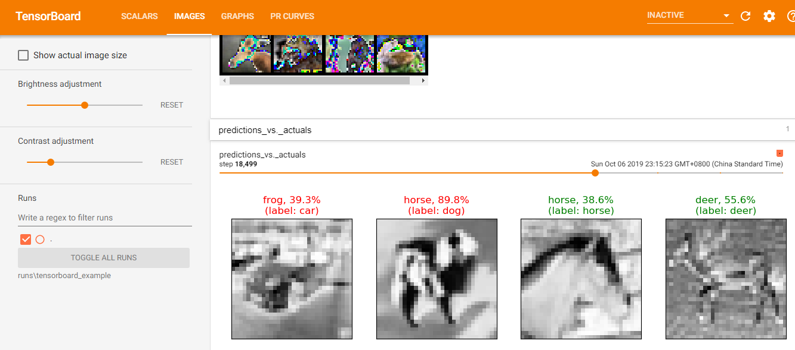
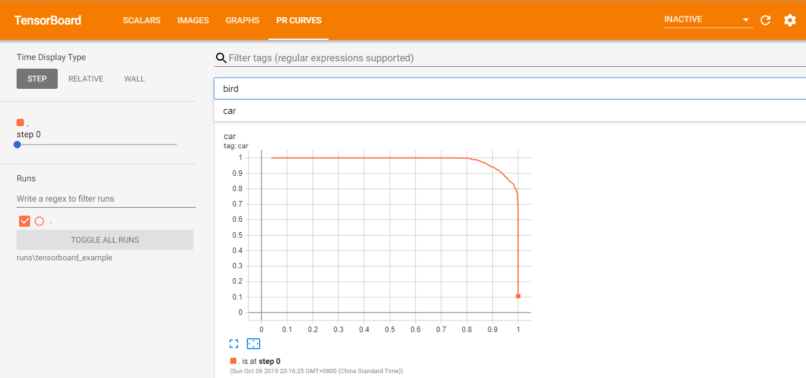

# Pytorch学习3 - TensorBoard: 模型、数据、训练可视化

在之前的学习中，实现了一个简单的图像分类器训练和测试。在训练模型期间，我们打印了一些简单的统计数据，比如，
每2000个训练样本打印平均损失函数返回，来确定训练的进程。但是，Pytorch还能做的更好，
Pytorch现已集成神经网络训练执行可视化工具TensorBoard。

TensorBoard是Google Tennsorflow提供的一套神经网络训练可视化工具。
目前除tensorflow之外还没有哪个深度学习库开发出了一套完美的可视化工具，这也是tensorflow流行的原因之一，
TensorBoard，可以帮助工程师可视化训练流程，自动保存变量，自动生成训练曲线。

原先，Pytorch项目如果想要使用TensorBoard，需要引入大牛Tzu-Wei Huang写的一个项目[tensorboardX](https://github.com/lanpa/tensorboardX).
但现在，自Pytorch v1.2之后，官方已经正式将TensorBoard集成到原生Pytorch中去了，现在可以直接使用。

本篇笔记将会学习，如何：
1. 启动TensorBoard
2. 编写数据TensorBoard
3. 使用TensorBoard查看模型结构
4. 使用TensorBoard创建可交互的可视化模型，并简化代码
- TensorBoard查看训练数据的几种方法
- 追踪模型训练性能
- 获取训练完成的模型性能

## 安装依赖

```
pip install --upgrade torch
pip install tensorboard
pip install future
```

## 加载数据 & 构建模型
仍然是以笔记1中的图像分类器为例

```python
import torch
import torchvision
from torchvision.transforms import transforms
import torch.nn as nn
import torch.nn.functional as F
import torch.optim as optim

# init dataset
transform = transforms.Compose(
    [transforms.ToTensor(),
     transforms.Normalize((0.5, 0.5, 0.5), (0.5, 0.5, 0.5))])
trainset = torchvision.datasets.CIFAR10(root='./data', train=True,
                                        download=True, transform=transform)
testset = torchvision.datasets.CIFAR10(root='./data', train=False,
                                       download=True, transform=transform)
# init dataloadeer
trainloader = torch.utils.data.DataLoader(trainset, batch_size=4,
                                          shuffle=True, num_workers=0)
testloader = torch.utils.data.DataLoader(testset, batch_size=4,
                                         shuffle=False, num_workers=0)
classes = ('plane', 'car', 'bird', 'cat',
           'deer', 'dog', 'frog', 'horse', 'ship', 'truck')


# define nn model
class Net(nn.Module):
    def __init__(self):
        super(Net, self).__init__()
        self.conv1 = nn.Conv2d(3, 6, 5)
        self.pool = nn.MaxPool2d(2, 2)
        self.conv2 = nn.Conv2d(6, 16, 5)
        self.fc1 = nn.Linear(16 * 5 * 5, 120)
        self.fc2 = nn.Linear(120, 84)
        self.fc3 = nn.Linear(84, 10)

    def forward(self, x):
        x = self.pool(F.relu(self.conv1(x)))
        x = self.pool(F.relu(self.conv2(x)))
        x = x.view(-1, 16 * 5 * 5)
        x = F.relu(self.fc1(x))
        x = F.relu(self.fc2(x))
        x = self.fc3(x)
        return x


net = Net()

# define loss function and optimizer
criterion = nn.CrossEntropyLoss()
optimizer = optim.SGD(net.parameters(), lr=0.001, momentum=0.9)

``` 

## 启动TensorBoard
创建一个`SummaryWriter`，这个对象会将运行时的数据写入到制动目录的一个二进制文件下。
默认目录是`runs`，可以使用参数指定
```python
from torch.utils.tensorboard import SummaryWriter

writer = SummaryWriter('runs/tensorboard_example')
```
上面一步只是配置了文件目录，并没有写入任何数据。

## 写入数据TensorBoard
有了上面的`SummaryWritter`，我们就可以使用该对象的`add_xxx`方法将需要展示的数据展示在相应的标签当中。

比如，展示训练集中的一批图片：
```python
import matplotlib.pyplot as plt
import numpy as np

# (used in the `plot_classes_preds` function below)
def matplotlib_imshow(img, one_channel=False):
    if one_channel:
        img = img.mean(dim=0)
    img = img / 2 + 0.5     # unnormalize
    npimg = img.numpy()
    if one_channel:
        plt.imshow(npimg, cmap="Greys")
    else:
        plt.imshow(np.transpose(npimg, (1, 2, 0)))

# get some random training images
dataiter = iter(trainloader)
images, labels = dataiter.next()

# create grid of images
img_grid = torchvision.utils.make_grid(images)

# show images
matplotlib_imshow(img_grid, one_channel=False)

# write to tensorboard
writer.add_image('four_fashion_mnist_images', img_grid)
writer.close()
```

执行完上面的代码之后，程序会在之前指定的`runs/tensorboard_example`目录下生成当前程序对应的数据文件。
运行下面的代码
```
tensorboard --logdir=runs\tensorboard_example
```

访问 http://localhost:6006 可以看见如图结果


## 使用TensorBoard查看模型结构
除了上面所说的预览训练集图片，下面还会列举一些常用的可视化工具
- 动态计算图
    - 通过动计算图，我们可以方便的看到复杂网络的结构
    - 双击计算图中的各个节点，还可以看到各个节点单元的更详细信息，方便我们查看或者调试模型
    - torch v1.2.0， Python 3.7 Windows上生成东岱计算图可能存在问题，会生成两个白框框
    修复详见 https://github.com/pytorch/pytorch/commit/a1cbadd605a19e964dd0a88d034a96303b16d2dc
```python
writer.add_graph(net, images)
```



- 损失函数和预测值
    - 我们可以在训练模型时将损失韩式和训练结果记录下来。
    - 通过 `add_scalar`方法记录每2000张训练图像的损失函数
    - 通过 `add_figure`方法记录预测结果与真实结果的比对
    - 训练模型的代码和笔记1中一模一样，在原先打印统计信息的地方，将数据写入`SummaryWriter`
```python
def images_to_probs(net, images):
    '''
    Generates predictions and corresponding probabilities from a trained
    network and a list of images
    '''
    output = net(images)
    # convert output probabilities to predicted class
    _, preds_tensor = torch.max(output, 1)
    preds = np.squeeze(preds_tensor.numpy())
    return preds, [F.softmax(el, dim=0)[i].item() for i, el in zip(preds, output)]


def plot_classes_preds(net, images, labels):
    '''
    Generates matplotlib Figure using a trained network, along with images
    and labels from a batch, that shows the network's top prediction along
    with its probability, alongside the actual label, coloring this
    information based on whether the prediction was correct or not.
    Uses the "images_to_probs" function.
    '''
    preds, probs = images_to_probs(net, images)
    # plot the images in the batch, along with predicted and true labels
    fig = plt.figure(figsize=(12, 48))
    for idx in np.arange(4):
        ax = fig.add_subplot(1, 4, idx+1, xticks=[], yticks=[])
        matplotlib_imshow(images[idx], one_channel=True)
        ax.set_title("{0}, {1:.1f}%\n(label: {2})".format(
            classes[preds[idx]],
            probs[idx] * 100.0,
            classes[labels[idx]]),
                    color=("green" if preds[idx]==labels[idx].item() else "red"))
    return fig

# start training
start = time.perf_counter()
for epoch in range(2):  # loop over the dataset multiple times

    running_loss = 0.0
    for i, data in enumerate(trainloader, 0):
        # get the inputs; data is a list of [inputs, labels]
        inputs, labels = data

        # zero the parameter gradients
        optimizer.zero_grad()

        # forward + backward + optimize
        outputs = net(inputs)
        loss = criterion(outputs, labels)
        loss.backward()
        optimizer.step()

        # print statistics
        running_loss += loss.item()
        if i % 2000 == 1999:  # print every 2000 mini-batches
            print('[%d, %5d] loss: %.3f' %
                  (epoch + 1, i + 1, running_loss / 2000))
            # ...log the running loss
            writer.add_scalar('training loss',
                              running_loss / 2000,
                              epoch * len(trainloader) + i)

            # ...log a Matplotlib Figure showing the model's predictions on a
            # random mini-batch
            writer.add_figure('predictions vs. actuals',
                              plot_classes_preds(net, inputs, labels),
                              global_step=epoch * len(trainloader) + i)
            running_loss = 0.0

end = time.perf_counter()
print('Finished Training, cost {:.6} seconds'.format(end - start))

```

- 查准率-查全率关系图 (PR Curves)
    - 查准率（Precision）和查全率（Recall） 我们将算法预测的结果分成四种情况： 
        1. 正确肯定（True Positive,TP）：预测为真，实际为真 
        2. 正确否定（True Negative,TN）：预测为假，实际为假 
        3. 错误肯定（False Positive,FP）：预测为真，实际为假 
        4. 错误否定（False Negative,FN）：预测为假，实际为真 
    - 查准率=TP/（TP+FP）例，在所有我们预测是小汽车的图像中，实际上是小汽车的百分比，越高越好。 
    - 查全率=TP/（TP+FN）例，在所有实际上是小汽车的图像中，成功预测的百分比，越高越好
    - 一般，降低阀值，提高Recall；提高阀值，提高Precision
```python
# Compare Predictive and actual
# 1. gets the probability predictions in a test_size x num_classes Tensor
# 2. gets the preds in a test_size Tensor
# takes ~10 seconds to run
class_probs = []
class_preds = []
with torch.no_grad():
    for data in testloader:
        images, labels = data
        output = net(images)
        class_probs_batch = [F.softmax(el, dim=0) for el in output]
        _, class_preds_batch = torch.max(output, 1)

        class_probs.append(class_probs_batch)
        class_preds.append(class_preds_batch)

test_probs = torch.cat([torch.stack(batch) for batch in class_probs])
test_preds = torch.cat(class_preds)

# plot all the pr curves
for i in range(len(classes)):
    add_pr_curve_tensorboard(i, test_probs, test_preds)
writer.close()
```
